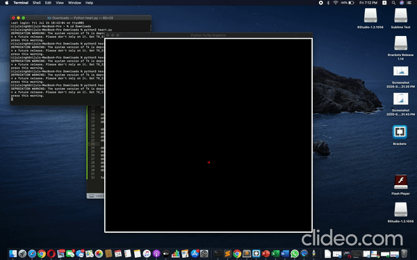

# Heart-shape
Creating heart shape in python using turtle.

## “Turtle” is a python feature like a drawing board, which lets you command a turtle to draw all over it!

You can use functions like turtle.forward(...) and turtle.left(...) which can move the turtle around.
- How to run 
- Download the code
- Run python3 heart.py

